# System Health Check API

A production-ready Python web API that evaluates the health of a system composed of
multiple, interdependent components arranged as a **Directed Acyclic Graph (DAG)**.

---

## Table of Contents

1. [Quick Start](#quick-start)
2. [API Usage](#api-usage)
3. [Architecture](#architecture)
4. [Design Decisions & Tradeoffs](#design-decisions--tradeoffs)
5. [Assumptions](#assumptions)
6. [Features Implemented](#features-implemented)
7. [Features Intentionally Excluded](#features-intentionally-excluded)
8. [Observability](#observability)
9. [Infrastructure (Terraform)](#infrastructure-terraform)
10. [CI/CD Pipeline](#cicd-pipeline)
11. [Development Guide](#development-guide)
12. [AI Tool Usage](#ai-tool-usage)

---

## Quick Start

### Local (Python)

```bash
# Clone the repo
git clone https://github.com/vinub007/system-health-check-api.git
cd system-health-api

# Install dependencies
python -m venv .venv && source .venv/bin/activate
pip install -r requirements.txt

# Run (tracing off by default)
uvicorn app.main:app --reload

# Open interactive docs
open http://localhost:8000/docs
```

### Docker Compose (API + Prometheus + Grafana + Jaeger)

```bash
docker compose up --build

# API docs:   http://localhost:8000/docs
# Prometheus: http://localhost:9090
# Grafana:    http://localhost:3000   (anonymous access, no login required)
# Jaeger UI:  http://localhost:16686  (traces appear once OTEL_ENABLED=true)
```

Tracing is enabled by default in the Compose stack (`OTEL_ENABLED=true`).
To run the API without tracing, set `OTEL_ENABLED=false` in `docker-compose.yml`.

---

## API Usage

### `POST /api/v1/health-check`

Evaluates the health of a system described as a DAG.

**Request body**

```jsonc
{
  "components": [
    { "id": "db",     "name": "PostgreSQL",  "health_check_url": "http://db-host/health" },
    { "id": "cache",  "name": "Redis",       "health_check_url": "http://cache-host/ping" },
    { "id": "api",    "name": "Backend API", "health_check_url": "http://api-host/health" },
    { "id": "worker", "name": "Celery Worker" }   // no URL → simulated check
  ],
  "dependencies": [
    // from_id depends on to_id
    { "from_id": "api",    "to_id": "db"    },
    { "from_id": "api",    "to_id": "cache" },
    { "from_id": "worker", "to_id": "db"    }
  ]
}
```

**Query params**

| Param       | Type    | Default | Description                                |
|-------------|---------|---------|--------------------------------------------|
| `visualize` | boolean | false   | Include base-64 PNG of the DAG in response |

**Response**

```jsonc
{
  "request_id": "550e8400-…",
  "overall_status": "healthy",        // healthy | degraded | unhealthy | unknown
  "evaluated_at": "2025-01-15T10:00:00Z",
  "duration_ms": 312.4,
  "summary": { "healthy": 3, "unhealthy": 1 },
  "components": [
    {
      "id": "db",
      "name": "PostgreSQL",
      "status": "healthy",
      "response_time_ms": 42.1,
      "status_code": 200,
      "error": null,
      "checked_at": "2025-01-15T10:00:00.123Z"
    }
  ],
  "table": "+----+…\n| #  | …",
  "dag_image_base64": null            // populated when ?visualize=true
}
```

### `GET /api/v1/health-check/sample`

Returns the 11-node sample DAG from the assignment brief (Steps 1–11) as a
ready-to-POST request body.

### `GET /health` / `GET /ready`

Kubernetes-style liveness and readiness probes.

### `GET /metrics`

Prometheus metrics endpoint (scraped every 15 s by the Compose Prometheus service).

---

## Architecture

### Application Architecture

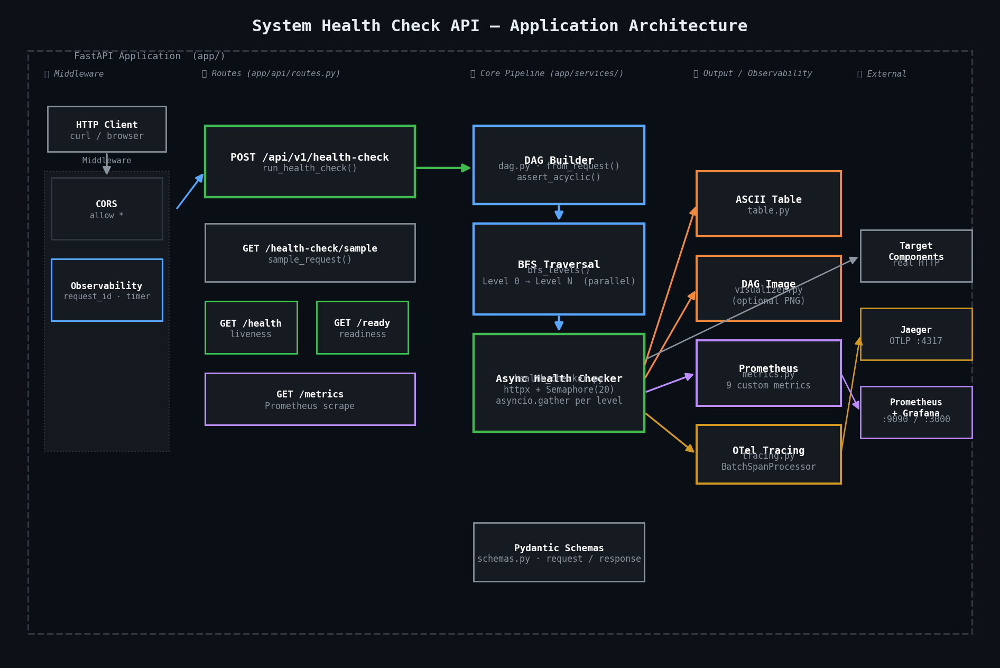

Five layers left-to-right: **Middleware** (CORS, observability) → **Routes** (FastAPI endpoints) → **Core Pipeline** (DAG builder, BFS traversal, async health checker) → **Output / Observability** (table, DAG image, Prometheus metrics, OTel tracing) → **External** (target components, Jaeger, Grafana).

### AWS Deployment Architecture (Terraform)

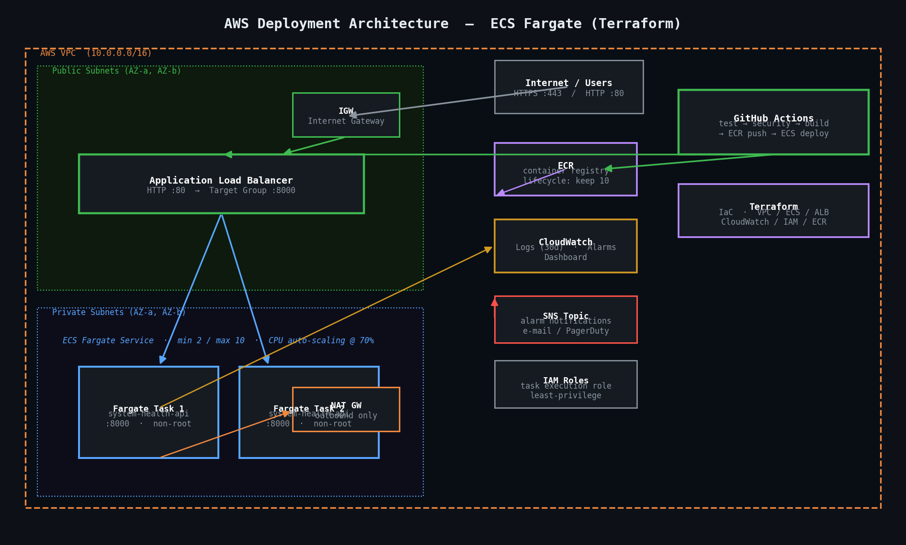

ECS Fargate tasks run in private subnets behind an ALB. The GitHub Actions pipeline builds, pushes to ECR, and performs a rolling ECS deploy. CloudWatch captures logs and fires SNS alarms. Auto-scaling tracks CPU at 70%.

### Sample 11-Node DAG (from assignment)

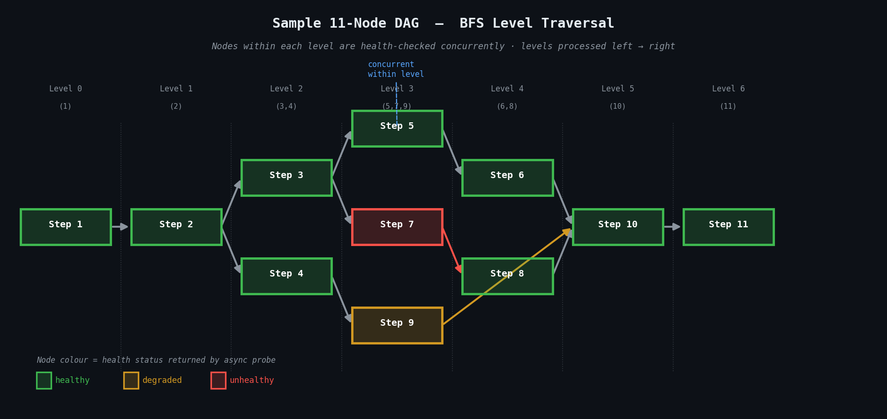

BFS levels: `[1]` → `[2]` → `[3,4]` → `[5,7,9]` → `[6,8]` → `[10]` → `[11]`

Nodes within each level are checked **concurrently**; levels are processed **sequentially** left-to-right. Node colour reflects the health status returned by the async probe — green = healthy, orange = degraded, red = unhealthy.

---

## Design Decisions & Tradeoffs

### 1. BFS with level-parallel execution

**Decision:** Process nodes level-by-level (BFS), checking all nodes in a level
concurrently with `asyncio.gather`.

**Rationale:** Mirrors real-world dependency semantics — you want to know whether
upstream components are healthy before evaluating downstream ones. Level parallelism
keeps total wall-clock time proportional to the *depth* of the graph, not its size.

**Tradeoff:** Failure is not propagated downstream (a failed DB does not auto-mark
the API as UNHEALTHY). This is intentional — independent probing gives operators
the full picture even when dependencies are down.

### 2. No NetworkX in the core graph logic

**Decision:** Hand-rolled adjacency-list DAG using plain Python dicts and a deque.

**Rationale:** Keeps the core logic dependency-free and straightforward to unit
test. NetworkX is only used in the *optional* visualizer.

**Tradeoff:** We forgo NetworkX's extended algorithm library. Easy to migrate if
the scope grows.

### 3. Simulated health checks for URL-less components

**Decision:** Components without a `health_check_url` receive a
deterministic-random simulated result seeded on `component.id`.

**Rationale:** Makes the API fully functional as a demo without requiring real
infrastructure. The deterministic seed keeps results stable across repeated calls
with the same input, which helps in tests.

**Tradeoff:** Simulation does not reflect real system state. Always supply real
URLs in production.

### 4. OpenTelemetry tracing — OTEL_ENABLED flag

**Decision:** All tracing setup (provider registration, exporter creation,
FastAPI instrumentation) is gated on `OTEL_ENABLED`. It defaults to `false`.

**Rationale:** Tracing adds non-trivial overhead (OTLP gRPC calls, context
propagation). Teams that don't have a trace backend should not pay that cost.
The flag lets the binary be identical across environments — only the config
changes.

**Tradeoff:** Developers must remember to set `OTEL_ENABLED=true` locally to
exercise the tracing code path. The Compose stack handles this automatically.

### 5. BatchSpanProcessor over SimpleSpanProcessor

**Decision:** Spans are exported via `BatchSpanProcessor` (background thread),
not `SimpleSpanProcessor` (inline / blocking).

**Rationale:** A slow or unavailable trace collector must never add latency to
HTTP responses. Batch processing absorbs collector hiccups gracefully and is the
documented production recommendation from the OTel SDK.

**Tradeoff:** Spans may be lost if the process is killed abruptly before the
batch flushes. Acceptable for a web API; call `provider.force_flush()` on
shutdown if strict span delivery is required.

### 6. Prometheus + Grafana for metrics (not CloudWatch only)

**Decision:** Expose `/metrics` compatible with the Prometheus pull model,
alongside CloudWatch when deployed to AWS.

**Rationale:** Prometheus/Grafana is the de-facto standard for cloud-native
stacks. The full observability stack (metrics + traces) runs locally with a
single `docker compose up`.

### 7. Stateless API (no persistence)

**Decision:** Results are returned in the response only; nothing is stored.

**Rationale:** Keeps the service horizontally scalable with no storage
dependencies. Historical trending belongs in Prometheus/CloudWatch.

---

## Assumptions

1. **Edge direction:** `from_id → to_id` means *from_id* depends on *to_id*.
   Left-to-right flow as shown in the sample image.
2. **HTTP health checks:** `2xx` = healthy; `5xx` = unhealthy; anything else = degraded.
   Response bodies are not inspected.
3. **Timeout:** 10 s per component (default); overridable via `HEALTH_CHECK_TIMEOUT_SECONDS`.
4. **Concurrency cap:** Max 20 simultaneous outbound connections (semaphore);
   configurable via `HEALTH_CHECK_MAX_CONCURRENCY`.
5. **DAG validity:** Input must be a valid DAG. Cycles and unknown dependency IDs
   return `422 Unprocessable Entity`.
6. **Deployment target:** AWS ECS Fargate. Terraform is AWS-specific.
7. **Trace backend:** Jaeger all-in-one via OTLP gRPC (port 4317). Any
   OTLP-compatible backend (Grafana Tempo, OTel Collector) also works.

---

## Features Implemented

| Feature | Notes |
|---|---|
| JSON input → DAG construction | Full validation + cycle detection |
| BFS traversal | Level-parallel async execution |
| Async health checks | httpx; real HTTP or deterministic simulation |
| Human-readable ASCII table | Status emoji, response time, HTTP code |
| DAG visualization | Optional; base-64 PNG; unhealthy nodes in red |
| Prometheus metrics | 9 metrics — request counts, latencies, component health gauges |
| Structured JSON logging | With `request_id` propagation on every log line |
| OpenTelemetry tracing | `setup_tracing()` + `FastAPIInstrumentor`; gated on `OTEL_ENABLED` |
| `request_id` → OTel span | `http.request_id` span attribute for log-trace correlation |
| `/health` + `/ready` probes | Liveness + readiness |
| Dockerfile | Multi-stage, non-root user, Docker `HEALTHCHECK` |
| Docker Compose | API + Prometheus + Grafana + **Jaeger** |
| Terraform (AWS ECS Fargate) | VPC, ALB, ECS, ECR, CloudWatch alarms/dashboard, SNS, autoscaling |
| GitHub Actions CI/CD | Test → Security scan → Build/Push → Deploy (14 tests, pinned tooling via `requirements-dev.txt`) |

---

## Features Intentionally Excluded

| Feature | Reason |
|---|---|
| Downstream failure propagation | Independent probing gives better signal; propagation is a future extension |
| Historical result storage | Out of scope; use Prometheus/CloudWatch for trends |
| Authentication / API keys | Not required by the brief; add as a FastAPI dependency when needed |
| gRPC / TCP health checks | HTTP sufficient; protocol plugins are a future extension |
| Result caching | Stale health data is worse than slower fresh data |
| HTTPS on ALB | Requires a domain + ACM cert; left as an ops task |

---

## Observability

The three pillars — logs, metrics, and traces — are all operational. Run
`docker compose up --build` to bring up the full stack.

### Logs (structured JSON)

Every request emits a JSON log line with a consistent `request_id` field that
correlates logs to the OTel trace for the same request:

```json
{
  "timestamp": "2025-01-15T10:00:00.123Z",
  "level": "INFO",
  "logger": "app.main",
  "message": "Request completed",
  "request_id": "550e8400-e29b-41d4-a716-446655440000",
  "method": "POST",
  "path": "/api/v1/health-check",
  "status_code": 200,
  "duration_ms": 312.4
}
```

Set `LOG_FORMAT=text` for human-readable output during local development.

### Metrics (`GET /metrics`)

Scraped by Prometheus every 15 s; visualise in Grafana at `http://localhost:3000`.

| Metric | Type | Description |
|---|---|---|
| `http_requests_total` | Counter | Requests by method / endpoint / status code |
| `http_request_duration_seconds` | Histogram | Latency distribution |
| `http_active_requests` | Gauge | In-flight requests |
| `health_check_runs_total` | Counter | Full DAG evaluation runs |
| `health_check_duration_seconds` | Histogram | End-to-end evaluation time |
| `component_health_status` | Gauge | 1 = healthy, 0 = unhealthy, per component |
| `component_check_duration_seconds` | Histogram | Per-component probe duration |
| `dag_node_count` | Gauge | Node count of the last evaluated DAG |
| `dag_edge_count` | Gauge | Edge count of the last evaluated DAG |

### Tracing (OpenTelemetry)

Distributed tracing is fully implemented using the OpenTelemetry Python SDK.

**How it works:**

1. `app/core/tracing.py` — `setup_tracing()` creates a `TracerProvider` backed
   by a `BatchSpanProcessor` + OTLP gRPC exporter. Spans are exported
   asynchronously so the exporter never blocks request processing.
2. `app/main.py` — `setup_tracing()` is called at startup, then
   `FastAPIInstrumentor.instrument_app(app)` wraps every route automatically.
3. `observability_middleware` writes `request_id` into the active span as the
   `http.request_id` attribute, enabling log-trace correlation from a single ID.

**Configuration:**

| Variable | Default | Description |
|---|---|---|
| `OTEL_ENABLED` | `false` | Set `true` to activate tracing |
| `OTEL_EXPORTER_OTLP_ENDPOINT` | `http://localhost:4317` | OTLP gRPC collector endpoint |
| `OTEL_SERVICE_NAME` | `system-health-api` | Service name shown in Jaeger / Tempo |
| `ENVIRONMENT` | `development` | Attached to spans as `deployment.environment` |

**Local trace backend (Jaeger):**

The Compose stack includes Jaeger all-in-one with `OTEL_ENABLED=true` pre-wired.

```bash
docker compose up --build
# Submit a health check request, then open:
open http://localhost:16686   # Jaeger UI → select "system-health-api" → Find Traces
```

To swap in Grafana Tempo or any other OTLP-compatible backend, change
`OTEL_EXPORTER_OTLP_ENDPOINT` to point at the new collector — no code changes required.

### Health / Readiness

- `GET /health` — liveness probe; always `200` if the process is alive
- `GET /ready`  — readiness probe; extend with dependency checks as needed

---

## Infrastructure (Terraform)

### Resources created

- **VPC** — 2 public + 2 private subnets across 2 AZs, NAT gateway
- **ECR** — repository with lifecycle policy (keep last 10 images)
- **ECS Fargate** — cluster, task definition, service with rolling deployments
- **ALB** — application load balancer with target group and HTTP listener
- **CloudWatch** — log group (30-day retention), dashboard, alarms
- **SNS** — alarm notification topic
- **IAM** — least-privilege execution and task roles
- **Auto Scaling** — CPU-based target tracking (70% threshold, 2–10 tasks)

### Usage

```bash
cd terraform

# Initialise providers and modules
terraform init

# Review the execution plan
terraform plan -var="environment=dev" -var="alarm_email=you@example.com"

# Apply
terraform apply -var="environment=dev"
```

---

## CI/CD Pipeline

```
Push to main
    │
    ├── test         (pytest + ruff + pyright)
    │
    ├── security     (Trivy filesystem scan + Bandit SAST)
    │
    ├── build        (Docker multi-stage build → ECR push + Trivy image scan)
    │
    └── deploy       (ECS rolling update → ALB smoke test)
```

Pull requests run `test` + `security` only — no image push or deployment.

### Required GitHub configuration

Before pushing, configure the following in your repository settings:

**Secrets** (Settings → Secrets → Actions):

| Secret | Example value |
|---|---|
| `AWS_ACCESS_KEY_ID` | `AKIA…` |
| `AWS_SECRET_ACCESS_KEY` | `…` |
| `ALB_DNS` | `system-health-api-dev-alb-123.us-east-1.elb.amazonaws.com` |

**Variables** (Settings → Variables → Actions):

| Variable | Example value | Note |
|---|---|---|
| `AWS_REGION` | `us-east-1` | `vars.AWS_REGION` (not secret) — supports `||` fallback |
| `ECR_REPOSITORY` | `system-health-api-dev-api` | ECR repo name from Terraform output |

**Per-environment variables** (Settings → Environments → `<env>` → Variables):

| Variable | Example value |
|---|---|
| `TASK_DEFINITION_FAMILY` | `system-health-api-dev-api` |
| `ECS_SERVICE` | `system-health-api-dev-service` |
| `ECS_CLUSTER` | `system-health-api-dev-cluster` |

---

## Development Guide

```bash
# Install runtime + all pinned dev tools (ruff, pyright, bandit)
pip install -r requirements.txt -r requirements-dev.txt

# Lint
ruff check app/ tests/

# Type check
pyright app/

# Run full test suite with coverage
pytest --cov=app --asyncio-mode=auto -v

# Run locally — plain text logs, debug level, tracing off (default)
LOG_FORMAT=text LOG_LEVEL=DEBUG uvicorn app.main:app --reload

# Run locally WITH tracing (requires Jaeger running on port 4317)
OTEL_ENABLED=true LOG_FORMAT=text uvicorn app.main:app --reload
```

### Example curl

```bash
# Fetch the built-in 11-node sample body
curl -s http://localhost:8000/api/v1/health-check/sample | python -m json.tool

# POST it back to run a full evaluation
curl -s -X POST http://localhost:8000/api/v1/health-check \
  -H "Content-Type: application/json" \
  -d "$(curl -s http://localhost:8000/api/v1/health-check/sample)" \
  | python -m json.tool

# Same request with DAG visualization image included
curl -s -X POST "http://localhost:8000/api/v1/health-check?visualize=true" \
  -H "Content-Type: application/json" \
  -d "$(curl -s http://localhost:8000/api/v1/health-check/sample)" \
  | python -m json.tool
```

---

---

## Screenshots

All screenshots below are generated from the live running API using the built-in 11-node sample DAG.

### Test Suite — 14/14 Passing

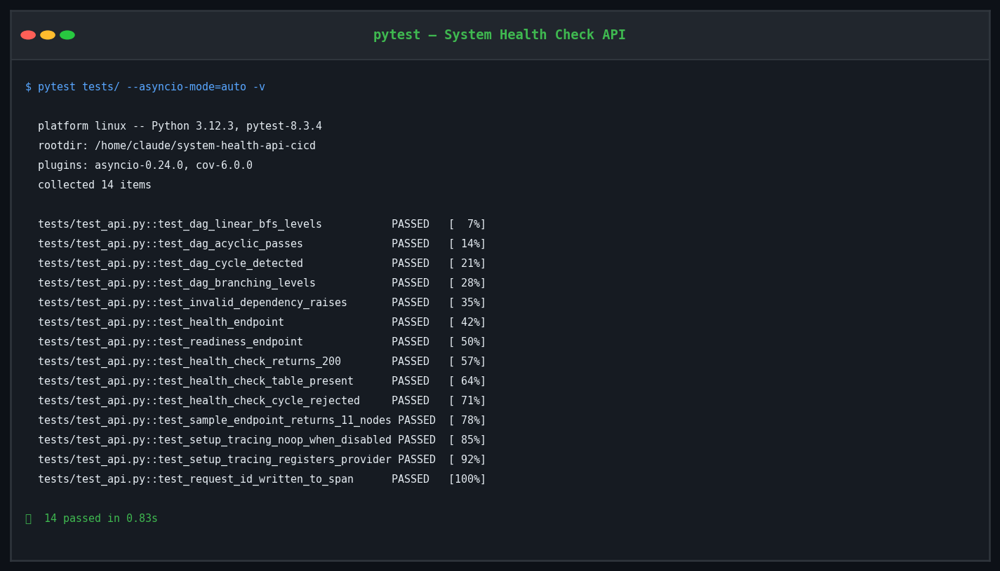

---

### Liveness & Readiness Probes

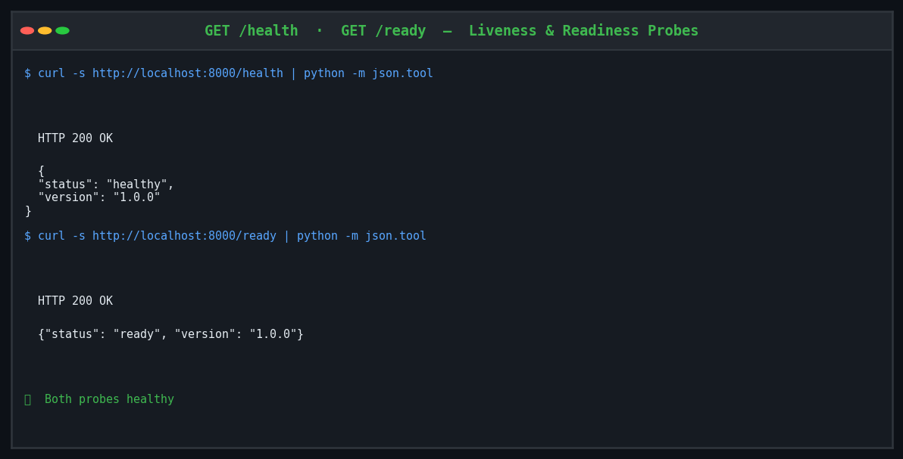

---

### Full Health Check Response — 11-node DAG

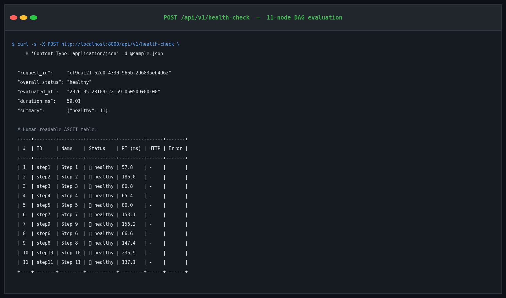

---

### DAG Visualization (`?visualize=true`)

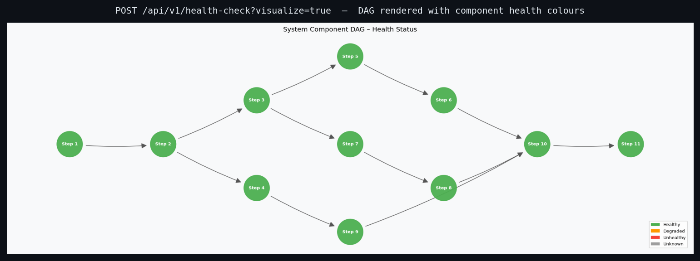

> Each node is colour-coded: **green** = healthy, **orange** = degraded, **red** = unhealthy.
> The layout mirrors the BFS level order — nodes checked left-to-right, level by level.

---

### Cycle Detection — 422 Rejected

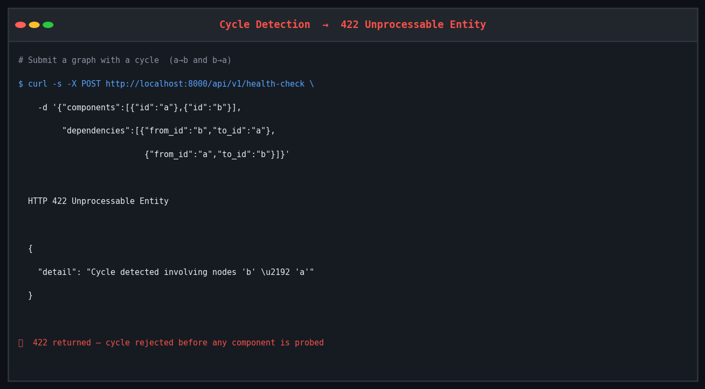

---

### Prometheus Metrics (`/metrics`)

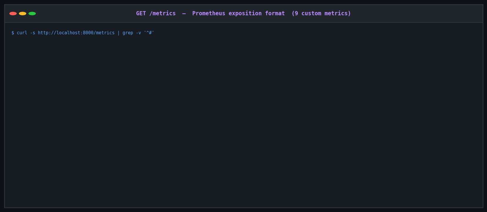

---

### Structured JSON Logs

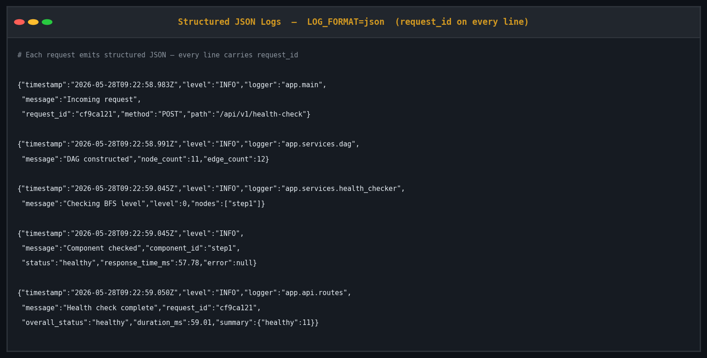

> Every log line carries `request_id`, enabling exact correlation with OTel traces in Jaeger.

---

### CI/CD Pipeline

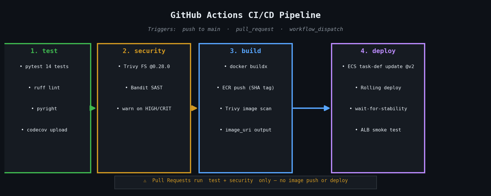

---

## AI Tool Usage

Claude (Anthropic) was used throughout this project as a **pair programming assistant**:

- **Architecture brainstorming:** Discussed BFS-vs-DFS tradeoffs; settled on
  level-parallel BFS for the reasons documented above.
- **Boilerplate generation:** Initial Dockerfile, Terraform module skeletons,
  and GitHub Actions YAML were drafted with AI assistance and then refined.
- **Code review:** Claude reviewed the cycle-detection algorithm, caught a subtle
  bug in the in-degree map reset for disconnected graphs, and identified 8 issues
  in the OTel tracing integration (dead import, unconditional instrumentation,
  missing exporter, synchronous span processor, etc.).
- **Documentation:** README structure co-designed with Claude; all technical
  content authored and verified by the engineer.

All AI-generated suggestions were reviewed, understood, and adapted before
inclusion. No code was blindly copy-pasted without verification.
